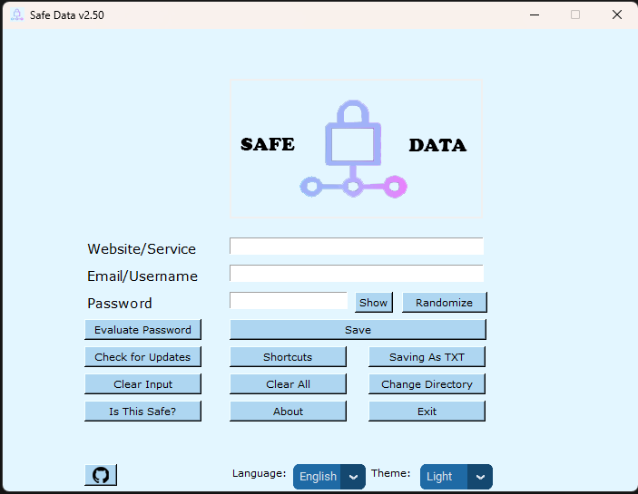
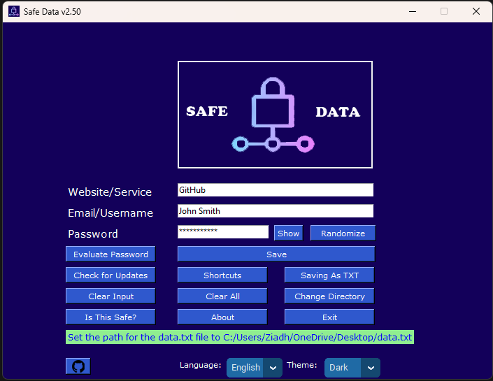
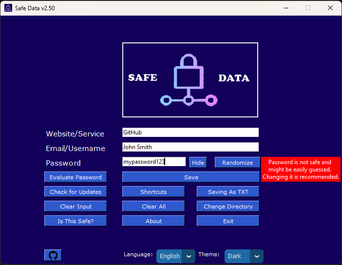

# Safe Data
 
[![Downloads][downloads-shield]][downloads-url]
[![License][license-shield]][license-url]
[![Language][language-shield]][language-url]
 [](https://github.com/ziadh/Safe-Data/releases)
 

 Python project that stores your logins LOCALLY. Nothing is being sent to the cloud or any online database. The main inspiration behind this project was me getting fed up with large password storing companies getting breached and having to worry if my data got compromised. 
 
 I am constantly looking for ways to add unique features and make the user experience better; Please if you have any ideas or suggestions let me know in the [Issues](https://github.com/ziadh/Safe-Data/issues) section.
- [Safe Data](#safe-data)
  - [How to Install](#how-to-install)
  - [Features](#features)
  - [Contributions](#contributions)
  - [License](#license)


## How to Install 

- Download [Python](https://www.python.org/downloads/) from here
- Download the [source file](https://github.com/ziadh/Safe-Data/archive/refs/heads/main.zip) from here
- After unzipping the source file and navigating to where the main.py file is located, press on the address bar as shown below then type cmd.


Run the following command to download all the required packages

```
pip install -r requirements.txt
```

When it is finished, close the cmd and simply double click the Safe-Data.pyw file or the .exe file.


## Features
- Generates a random hard-to-guess password and add it to your clipboard
  


- Saves your logins LOCALLY to your machine. It does not upload them anywhere.
  


- Brand new light mode! 
     * Classic themes can be toggled by simply pressing on the moon icon





- Choose where to save your data





- Checks if your password passes basic safety measures



- Now supports Spanish, more languages to come!


What's New?
- Updated buttons in dark mode to look more blue-y
- About window is now accessed by pressing Control + B (Previously Ctrl + A)
- Added Github button to open up the project's github page
- Merged About and Help buttons into one button
- Added spanish support for shortcuts
- Updated the show/hide with the actual text instead of symbol (icon would not show properly on some W11 systems)
- Improved overall look and theme of shortcuts window
- Added a shortcut for show/hide password
- Fixed a bug that would change the color of the buttons after hovering over them in classic light mode
- Shortcuts window should no longer show up in awkward spots at certain times
- You can now save your logins using ENTER on PC and RETURN on Mac
**Full Changelog**: https://github.com/ziadh/Safe-Data/compare/2.0...2.10

## Contributions
Contributions are appreciated.
## License
MIT License

[downloads-shield]: https://img.shields.io/github/downloads/ziadh/Safe-Data/total?style=for-the-badge&logo=github
[downloads-url]: https://github.com/ziadh/Safe-Data/releases/latest
[license-shield]: https://img.shields.io/github/license/ziadh/Safe-Data?style=for-the-badge
[license-url]: https://github.com/ziadh/Safe-Data/blob/main/LICENSE
[language-shield]: https://img.shields.io/github/languages/top/ziadh/safe-data?logo=python&logoColor=yellow&style=for-the-badge
[language-url]: https://www.python.org/
